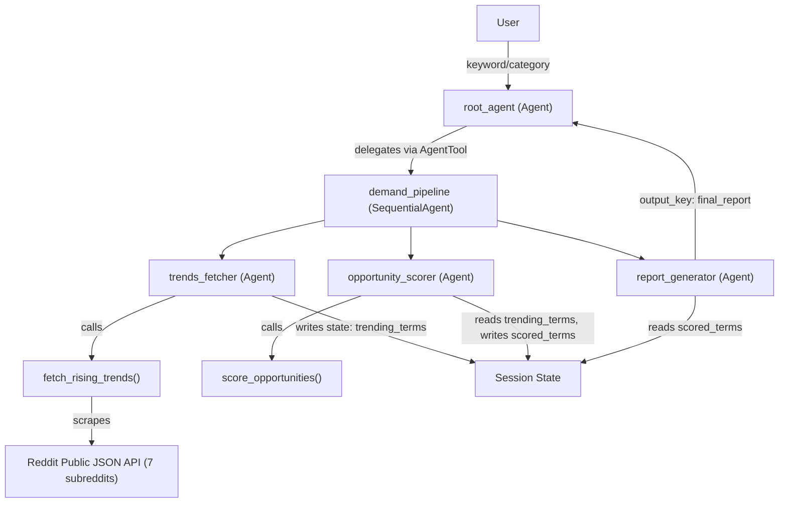

# ARCHITECTURE: ecommerce_product_spotter

## 1. System Overview

The E-Commerce Product Demand Spotter is a sequential pipeline agent built on Google ADK. A conversational root agent gathers the user's product category or keyword, then delegates to a SequentialAgent pipeline that fetches trending Reddit posts, scores them by e-commerce opportunity, and generates a formatted seller report. The final report is returned as a chat message.

## 2. Architecture Diagram

## 3. Agent Hierarchy

| Agent | Type | Model | Role | Tools |
|-------|------|-------|------|-------|
| `root_agent` | Agent (LlmAgent) | `gemini-2.0-flash` | Conversational entry point; gathers keyword from user, delegates to pipeline, returns report | `AgentTool(demand_pipeline)` |
| `demand_pipeline` | SequentialAgent | — (no LLM) | Orchestrates the 3-step pipeline in order | — |
| `trends_fetcher` | Agent (LlmAgent) | `gemini-2.0-flash` | Calls Reddit fetch tool to retrieve trending posts, stores in state | `fetch_rising_trends` |
| `opportunity_scorer` | Agent (LlmAgent) | `gemini-2.0-flash` | Reads trends from state, scores by e-commerce opportunity | `score_opportunities` |
| `report_generator` | Agent (LlmAgent) | `gemini-2.5-flash` | Reads scored terms from state, generates formatted seller report | — (LLM-only, no tools) |

## 4. Data Flow & State Keys

| Step | Agent | Reads | Writes | State Key |
|------|-------|-------|--------|-----------|
| 1 | `root_agent` | user input | keyword | `user_keyword` |
| 2 | `trends_fetcher` | `user_keyword` | raw Reddit posts | `trending_terms` |
| 3 | `opportunity_scorer` | `trending_terms` | scored + ranked posts | `scored_terms` |
| 4 | `report_generator` | `scored_terms` | final report text | `final_report` (output_key) |
| 5 | `root_agent` | `final_report` | — | returns to user |

**State key types:**
- `user_keyword`: `str` — the user's input keyword/category
- `trending_terms`: `str` — JSON-serialized list of Reddit post dicts
- `scored_terms`: `str` — JSON-serialized list of scored post dicts
- `final_report`: `str` — formatted markdown report text

## 5. Technology Stack

| Component | Version/Choice |
|-----------|---------------|
| Python | 3.11+ |
| Google ADK | latest stable (google-adk) |
| LLM | gemini-2.0-flash (sub-agents), gemini-2.5-flash (report) |
| Data Source | Reddit public JSON API (no auth required) |
| Session | InMemorySessionService (local dev) |

## 6. Security Architecture

- API keys stored in `.env`, auto-loaded by ADK, accessed via `os.getenv()`
- `.env` is gitignored — never committed
- No credentials hardcoded in source
- Reddit API requires no authentication (public JSON endpoints)
- No sensitive user data stored in state

## 7. Scalability

- Stateless tools: all tools are pure functions with no side effects beyond state writes
- InMemorySessionService for local dev — swap to DatabaseSessionService for production
- Pipeline pattern allows adding/removing stages independently
